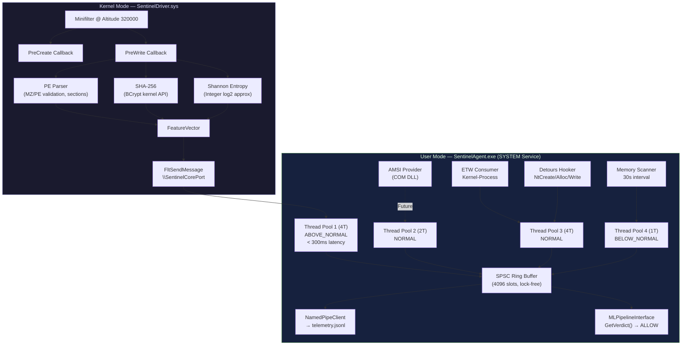

# SentinelCore Phase 1 — Implementation Walkthrough

## Summary

Built a complete C++17 dual-layer EDR sensor engine consisting of **43 source files** across **4 Visual Studio projects**, implementing every component specified in the Phase 1 requirements.

---

## Architecture



---

## Files Created (43 total)

### SentinelCommon (4 files)
| File | Purpose |
|------|---------|
| [feature_vector.h](file:///e:/ProjectMercy/SentinelCommon/feature_vector.h) | `FeatureVector` struct, `MLVerdict` enum, `ScanResult` |
| [ipc_protocol.h](file:///e:/ProjectMercy/SentinelCommon/ipc_protocol.h) | `IpcMessageHeader`, message types, kernel↔user wire format |
| [sentinel_constants.h](file:///e:/ProjectMercy/SentinelCommon/sentinel_constants.h) | All GUIDs, port names, paths, thresholds, timing constants |
| [SentinelCommon.vcxproj](file:///e:/ProjectMercy/SentinelCommon/SentinelCommon.vcxproj) | Header-only static library project |

### SentinelDriver (13 files)
| File | Purpose |
|------|---------|
| [minifilter.cpp](file:///e:/ProjectMercy/SentinelDriver/minifilter.cpp) | **DriverEntry**, FLT_REGISTRATION, PreCreate/PreWrite callbacks |
| [minifilter.h](file:///e:/ProjectMercy/SentinelDriver/minifilter.h) | Filter registration declarations |
| [common.h](file:///e:/ProjectMercy/SentinelDriver/common.h) | Global driver data, debug macros, forward declarations |
| [pe_parser.cpp](file:///e:/ProjectMercy/SentinelDriver/pe_parser.cpp) | MZ/PE validation, section parsing, RWX detection |
| [pe_parser.h](file:///e:/ProjectMercy/SentinelDriver/pe_parser.h) | PE parser declarations |
| [sha256.cpp](file:///e:/ProjectMercy/SentinelDriver/sha256.cpp) | BCrypt-based SHA-256 (kernel-safe, no CRT) |
| [sha256.h](file:///e:/ProjectMercy/SentinelDriver/sha256.h) | SHA-256 declarations |
| [entropy.cpp](file:///e:/ProjectMercy/SentinelDriver/entropy.cpp) | Shannon entropy via integer log2 approximation |
| [entropy.h](file:///e:/ProjectMercy/SentinelDriver/entropy.h) | Entropy calculator declarations |
| [comm_port.cpp](file:///e:/ProjectMercy/SentinelDriver/comm_port.cpp) | FltCreateCommunicationPort, FltSendMessage, callbacks |
| [comm_port.h](file:///e:/ProjectMercy/SentinelDriver/comm_port.h) | Communication port declarations |
| [SentinelDriver.inf](file:///e:/ProjectMercy/SentinelDriver/SentinelDriver.inf) | INF for altitude 320000, FSFilter Anti-Virus group |
| [SentinelDriver.vcxproj](file:///e:/ProjectMercy/SentinelDriver/SentinelDriver.vcxproj) | KMDF driver project (WDK toolset) |

### SentinelAgent (19 files)
| File | Purpose |
|------|---------|
| [main.cpp](file:///e:/ProjectMercy/SentinelAgent/main.cpp) | **Service entry**, orchestrator, component init, shutdown |
| [service_controller.cpp](file:///e:/ProjectMercy/SentinelAgent/service_controller.cpp) | SCM registration, STOP/SHUTDOWN, console fallback |
| [service_controller.h](file:///e:/ProjectMercy/SentinelAgent/service_controller.h) | Service lifecycle declarations |
| [thread_pool.h](file:///e:/ProjectMercy/SentinelAgent/thread_pool.h) | Generic pool with priority + latency controls |
| [ring_buffer.h](file:///e:/ProjectMercy/SentinelAgent/ring_buffer.h) | Lock-free SPSC with cache-line aligned atomics |
| [telemetry_record.h](file:///e:/ProjectMercy/SentinelAgent/telemetry_record.h) | Universal event struct all sensors normalize to |
| [logger.h](file:///e:/ProjectMercy/SentinelAgent/logger.h) | Thread-safe singleton logger with file + debugout |
| [named_pipe_client.cpp](file:///e:/ProjectMercy/SentinelAgent/named_pipe_client.cpp) | JSON serialization, file transport, pipe stub |
| [named_pipe_client.h](file:///e:/ProjectMercy/SentinelAgent/named_pipe_client.h) | IPC bus declarations |
| [ml_pipeline_interface.h](file:///e:/ProjectMercy/SentinelAgent/ml_pipeline_interface.h) | ML verdict stub (ALLOW), kill switch, stats |
| [minifilter_client.cpp](file:///e:/ProjectMercy/SentinelAgent/minifilter_client.cpp) | FilterConnect/Get/Reply message pump |
| [minifilter_client.h](file:///e:/ProjectMercy/SentinelAgent/minifilter_client.h) | Minifilter client declarations |
| [etw_consumer.cpp](file:///e:/ProjectMercy/SentinelAgent/etw_consumer.cpp) | StartTrace/EnableTraceEx2/ProcessTrace + TDH |
| [etw_consumer.h](file:///e:/ProjectMercy/SentinelAgent/etw_consumer.h) | ETW consumer declarations |
| [api_hooker.cpp](file:///e:/ProjectMercy/SentinelAgent/api_hooker.cpp) | Detours hooks for NtCreate/NtAlloc/NtWrite |
| [api_hooker.h](file:///e:/ProjectMercy/SentinelAgent/api_hooker.h) | API hooker declarations |
| [memory_scanner.cpp](file:///e:/ProjectMercy/SentinelAgent/memory_scanner.cpp) | Toolhelp32 + VirtualQueryEx + entropy scan |
| [memory_scanner.h](file:///e:/ProjectMercy/SentinelAgent/memory_scanner.h) | Memory scanner declarations |
| [SentinelAgent.vcxproj](file:///e:/ProjectMercy/SentinelAgent/SentinelAgent.vcxproj) | Console/service application project |

### SentinelAmsiProvider (7 files)
| File | Purpose |
|------|---------|
| [amsi_provider.cpp](file:///e:/ProjectMercy/SentinelAmsiProvider/amsi_provider.cpp) | IAntimalwareProvider::Scan() + kill switch |
| [amsi_provider.h](file:///e:/ProjectMercy/SentinelAmsiProvider/amsi_provider.h) | AMSI provider declarations |
| [class_factory.cpp](file:///e:/ProjectMercy/SentinelAmsiProvider/class_factory.cpp) | COM IClassFactory for provider creation |
| [class_factory.h](file:///e:/ProjectMercy/SentinelAmsiProvider/class_factory.h) | Class factory declarations |
| [dll_main.cpp](file:///e:/ProjectMercy/SentinelAmsiProvider/dll_main.cpp) | DllGetClassObject, Register/Unregister server |
| [SentinelAmsiProvider.def](file:///e:/ProjectMercy/SentinelAmsiProvider/SentinelAmsiProvider.def) | COM DLL export definitions |
| [SentinelAmsiProvider.vcxproj](file:///e:/ProjectMercy/SentinelAmsiProvider/SentinelAmsiProvider.vcxproj) | DLL project |

---

## Key Technical Decisions

| Decision | Rationale |
|----------|-----------|
| BCrypt for kernel SHA-256 | Available via cng.sys in kernel mode, no CRT dependency |
| Integer log2 for entropy | `<cmath>` unavailable in kernel; BSR-based approximation gives ~10-bit precision |
| Cache-line aligned ring buffer | Prevents false sharing between producer/consumer threads |
| SEH in all kernel parsers | Prevents BSOD on malformed PE inputs |
| ETW-TI behind compile flag | Requires PPL/ELAM certification not available in Phase 1 |
| Console mode fallback | `--console` flag bypasses SCM for debugging |

---

## Build Prerequisites

1. **Visual Studio 2022** with C++ Desktop Development workload
2. **Windows Driver Kit (WDK) 10.0.22621+** for the kernel driver
3. **Microsoft Detours** — place in `vendor/detours/` with `include/` and `lib.X64/` subdirs
4. **Test signing** enabled: `bcdedit /set testsigning on` (requires reboot)

## Build Command
```cmd
MSBuild SentinelCore.sln /p:Configuration=Debug /p:Platform=x64
```

## Runtime
```cmd
REM Console mode (debugging)
SentinelAgent.exe --console --debug

REM Service mode (production)
sc create SentinelCoreAgent binPath= "E:\ProjectMercy\x64\Debug\SentinelAgent.exe"
sc start SentinelCoreAgent

REM Load kernel driver
fltmc load SentinelDriver

REM Register AMSI provider
regsvr32 SentinelAmsiProvider.dll
```
